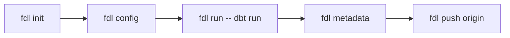

# Quick Start

This guide walks you through initializing a data catalog and deploying it to remote storage.

## Prerequisites

- Python 3.13+
- [uv](https://docs.astral.sh/uv/) (recommended) or pip
- dbt (for pipeline execution)
- S3-compatible storage (for remote push/pull)

## 1. Install

```bash
uv add frozen-ducklake
```

## 2. Initialize Project

```bash
fdl init my-dataset
```

This generates:

- `fdl.toml` — Project config (tracked in Git)
- `.fdl/` — DuckLake catalog and artifacts (auto-added to `.gitignore`)

For [dlt integration](../integrations/dlt.md), use a SQLite catalog:

```bash
fdl init my-dataset --sqlite
```

## 3. Configure Remotes

Register remote storage as a Named Remote.

### S3 Storage

Set S3 endpoint and credentials:

```bash
fdl config s3.endpoint https://your-s3-endpoint.com
fdl config s3.access_key_id YOUR_ACCESS_KEY
fdl config s3.secret_access_key YOUR_SECRET_KEY
```

Register the remote:

```bash
fdl config --local remotes.origin s3://my-bucket
```

!!! tip
    S3 credentials are stored in `~/.fdl/config` (user level).
    Remote URLs can be stored with `--local` in `.fdl/config` (workspace level),
    or written directly in `fdl.toml` to share with the team.

### Local Storage

```bash
fdl config --local remotes.local /path/to/storage
```

## 4. Build Pipeline

Run your dbt pipeline. `fdl run` automatically injects the required environment variables
(`FDL_STORAGE`, `FDL_DATA_PATH`, etc.):

```bash
fdl run -- dbt run
```

## 5. Generate Metadata

Generate metadata from dbt artifacts:

```bash
fdl metadata
```

This creates `.fdl/metadata.json` containing table/column definitions and lineage information.

## 6. Push to Remote

Upload the catalog and metadata to the remote:

```bash
fdl push origin
```

SQLite catalogs are automatically converted to DuckDB format during push.

## 7. Pull from Remote

To retrieve a catalog in a different environment:

```bash
fdl init my-dataset
fdl pull origin
```

## Typical Workflow



1. `fdl init` — Initialize the project
2. `fdl config` — Configure remotes and credentials
3. `fdl run -- dbt run` — Execute the pipeline
4. `fdl metadata` — Generate metadata
5. `fdl push origin` — Deploy to remote

## Next Steps

- [Configuration](../concepts/configuration.md) — Details on 3-layer config management
- [CLI Reference](../cli/index.md) — Full command reference
